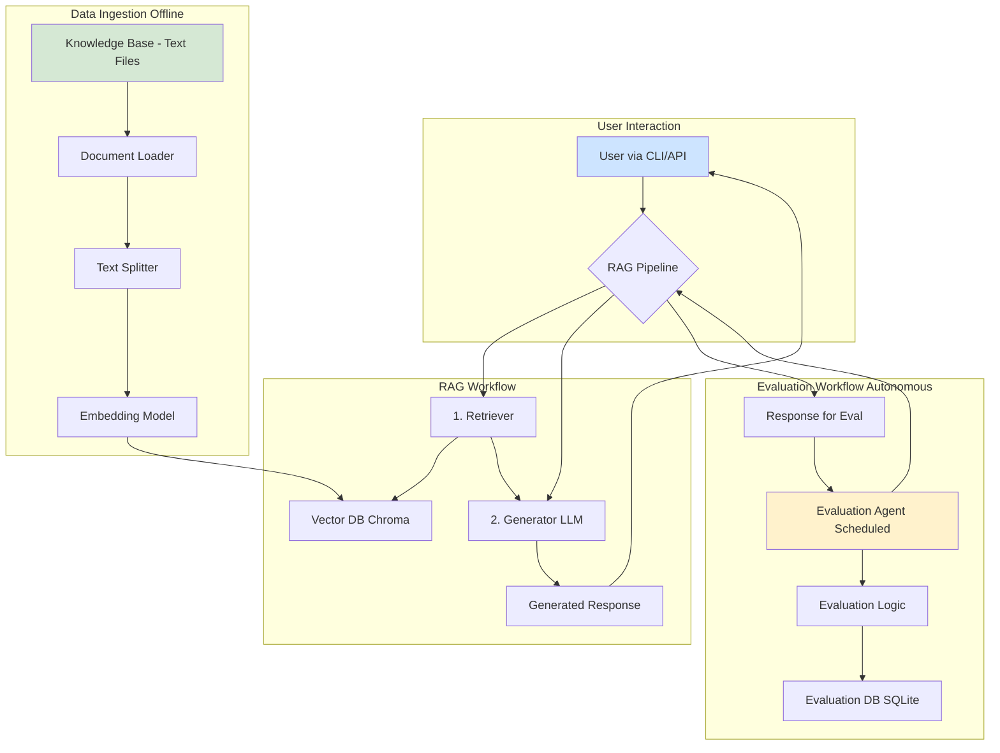

# AutoRAG: System Architecture Design

---

## Document Information

| Field | Value |
|-------|-------|
| **Project Name** | AutoRAG (Autonomous Retrieval-Augmented Generation) |
| **Document Type** | System Architecture Design |
| **Version** | 1.1 |
| **Last Updated** | January 25, 2026 |
| **Status** | Final |
| **Changes** | Updated from FAISS to Chroma for vector database |

---

## 1. Architecture Overview

The AutoRAG system is designed as a modular, end-to-end solution for building and evaluating a Retrieval-Augmented Generation pipeline. The architecture is composed of two primary workflows: the **RAG Workflow** for answering user queries and the **Evaluation Workflow** for autonomously assessing the system's performance.

The design prioritizes simplicity, modularity, and adherence to the defined MVP scope, while allowing for future expansion. It leverages a local-first approach for core components (Chroma, SQLite) to minimize costs and complexity, consistent with the project constraints.

---

## 2. System Architecture Diagram

Below is a diagram representing the high-level architecture of the AutoRAG system. It illustrates the key components and their interactions across the two main workflows.



**How to View the Diagram:**
*   If you have the **Markdown Preview Enhanced** extension in VS Code, this diagram will render automatically in the preview pane.
*   Alternatively, you can copy the `mermaid` code block and paste it into an online editor like the [**Mermaid Live Editor**](https://mermaid.live) to see the visual diagram.

---

## 3. Component Breakdown

This section provides a detailed description of each component outlined in the architecture diagram.

| Component | Technology | Description |
| :--- | :--- | :--- |
| **1. Data Ingestion Pipeline** | Python, LangChain | An offline script responsible for loading documents from a local directory, splitting them into manageable chunks, generating embeddings using an OpenAI model, and storing them in the vector database. |
| **2. Vector Database** | Chroma | A local, file-based vector store that indexes document embeddings for efficient similarity search. Chroma integrates seamlessly with LangChain and provides automatic embedding generation, making it ideal for the MVP. |
| **3. RAG Pipeline** | LangChain | The core of the system. It orchestrates the retrieval of relevant document chunks from the Vector DB and the generation of a final answer by an LLM, using the retrieved context. |
| **4. User Interface** | Python (CLI/FastAPI) | A simple command-line interface (CLI) or a basic FastAPI endpoint to allow a user to submit questions to the RAG Pipeline and receive answers. |
| **5. Autonomous Evaluation Agent** | CrewAI / Python Scheduler | A scheduled process that autonomously runs a set of predefined questions against the RAG pipeline, captures the responses, and passes them to the evaluation logic. |
| **6. Evaluation Logic** | Python, LangChain | A module that assesses the quality of the RAG system's responses based on metrics like accuracy and relevance. It uses an LLM to perform the assessment. |
| **7. Evaluation Database** | SQLite | A local, file-based SQL database used to log the results of each evaluation run, including the question, response, score, and any feedback from the evaluation logic. |

---

## 4. Data Flow

This section describes the sequence of data movement within the system for the two primary workflows.

### 4.1. RAG Workflow (Querying)

1.  **Query Input:** A user submits a question through the CLI or API.
2.  **Retrieval:** The RAG Pipeline's Retriever takes the user's query, creates an embedding for it, and queries the Chroma Vector Database to find the most similar (i.e., relevant) document chunks.
3.  **Context Augmentation:** The retrieved document chunks are compiled into a context string.
4.  **Generation:** The context and the original query are passed to the Generator (LLM), which produces a final, human-readable answer.
5.  **Response Output:** The generated answer is returned to the user via the CLI or API.

### 4.2. Evaluation Workflow (Autonomous Assessment)

1.  **Trigger:** A scheduler (e.g., a cron job or a Python `schedule` library) activates the Evaluation Agent.
2.  **Question Execution:** The agent iterates through a predefined list of evaluation questions and sends each one to the RAG Pipeline.
3.  **Response Capture:** The agent receives the generated response from the pipeline for each question.
4.  **Quality Assessment:** The agent invokes the Evaluation Logic, providing the question, the ground truth (if available), and the generated response. The logic uses an LLM to score the response on accuracy and relevance.
5.  **Logging:** The agent logs the complete evaluation record (question, response, scores, timestamp) into the SQLite Evaluation Database for later analysis.

---

## 5. Technology Stack

This table summarizes the technology choices for the project, aligning with the MVP scope and constraints.

| Category | Technology | Justification |
| :--- | :--- | :--- |
| **Programming Language** | Python 3.10+ | The standard for AI/ML development with extensive library support. |
| **AI Framework** | LangChain | Simplifies the creation of RAG pipelines and agentic workflows. |
| **Agent Framework** | CrewAI | Provides a straightforward structure for creating the autonomous evaluation agent. |
| **LLM Provider** | OpenAI | Offers high-quality models for embedding and generation, accessible via a simple API. |
| **Vector Database** | Chroma | A local-first vector database with seamless LangChain integration, automatic embedding generation, and no compilation requirements. Ideal for MVP deployment. |
| **Evaluation Database** | SQLite | A serverless, file-based database perfect for simple, local logging without requiring a separate database server. |
| **User Interface** | Python `argparse` / FastAPI | Provides a simple and effective way to interact with the system for the MVP, fulfilling the CLI/API requirement. |
| **Code Editor** | Visual Studio Code | A versatile and powerful editor with excellent Python and Git integration. |
| **Version Control** | Git & GitHub | Industry standard for version control and collaborative development. |

---

## 6. Design Principles

*   **Modularity:** Each component (ingestion, RAG, evaluation) is designed to be independent, allowing for easier testing, maintenance, and future upgrades.
*   **Simplicity (MVP First):** The architecture intentionally uses simple, local-first technologies (Chroma, SQLite) to meet the project constraints and ensure rapid development.
*   **Technology Choice:** Chroma was selected over FAISS due to superior compatibility with Python 3.14+, seamless LangChain integration, and elimination of build complexity.
*   **Extensibility:** The design allows for future enhancements, such as swapping the local vector database for a cloud-based one or adding a more sophisticated UI, as outlined in the Post-MVP scope.

---

## 7. Future Considerations (Post-MVP)

This architecture provides a solid foundation for the out-of-scope features defined in the `SCOPE.md` document. Future work could include:

*   **Replacing Chroma:** The `Vector Database` component can be replaced with a production-grade service like Pinecone, Weaviate, or a cloud-native solution like Snowflake Vector Search with minimal changes to the RAG pipeline.
*   **Replacing SQLite:** The `Evaluation Database` can be migrated to a more robust cloud database like PostgreSQL on AWS RDS or Snowflake for better scalability and analytics.
*   **Adding a UI:** A web interface (e.g., using Streamlit or React) can be built on top of the FastAPI endpoint to provide a richer user experience.
*   **Multi-Model Support:** Support for additional LLM providers (Claude, Gemini, Llama) to provide flexibility and cost optimization.
*   **Advanced Retrieval:** Implementation of hybrid search combining dense and sparse retrieval methods for improved accuracy.

---

## 8. Chroma Vector Database Details

### 8.1 Why Chroma?

Chroma was selected as the vector database for AutoRAG based on the following advantages:

*   **Python 3.14+ Compatibility:** Unlike FAISS, Chroma has full compatibility with Python 3.14 without compilation issues.
*   **LangChain Integration:** Native integration with LangChain eliminates adapter code and simplifies the RAG pipeline.
*   **Automatic Embeddings:** Chroma can automatically generate embeddings using OpenAI's embedding models, reducing boilerplate code.
*   **Persistent Storage:** Local SQLite-backed storage ensures data persistence without external dependencies.
*   **Simple API:** Intuitive Python API makes it easy to add, search, and manage embeddings.
*   **No Build Requirements:** Unlike FAISS, Chroma requires no compilation, making it portable across different systems.

### 8.2 Chroma Architecture

Chroma operates as follows:

1. **Collection Creation:** Documents are organized into collections for logical grouping.
2. **Embedding Generation:** Text is automatically converted to embeddings using the configured embedding model.
3. **Vector Storage:** Embeddings are stored in a local SQLite database with metadata.
4. **Similarity Search:** Queries are embedded and compared against stored embeddings using cosine similarity.
5. **Metadata Filtering:** Results can be filtered based on metadata (source, date, etc.).

### 8.3 Chroma Configuration

```python
from langchain.vectorstores import Chroma
from langchain.embeddings.openai import OpenAIEmbeddings

# Initialize embeddings
embeddings = OpenAIEmbeddings(model="text-embedding-3-small")

# Create or load Chroma vector store
vectorstore = Chroma(
    collection_name="autorag_documents",
    embedding_function=embeddings,
    persist_directory="./data/chroma_db"
)
```

---

## 9. Integration Points

### 9.1 LangChain Integration

Chroma integrates seamlessly with LangChain's RAG components:

```python
from langchain.chains import RetrievalQA
from langchain.llms import OpenAI

# Create retriever from Chroma
retriever = vectorstore.as_retriever(search_kwargs={"k": 5})

# Create RAG chain
qa_chain = RetrievalQA.from_chain_type(
    llm=OpenAI(),
    chain_type="stuff",
    retriever=retriever
)
```

### 9.2 Data Ingestion Integration

```python
from langchain.document_loaders import DirectoryLoader
from langchain.text_splitter import CharacterTextSplitter

# Load documents
loader = DirectoryLoader("./data/knowledge_base")
documents = loader.load()

# Split documents
splitter = CharacterTextSplitter(chunk_size=512, chunk_overlap=50)
chunks = splitter.split_documents(documents)

# Add to Chroma
vectorstore.add_documents(chunks)
```

---

## 10. Performance Characteristics

| Metric | Value | Notes |
| :--- | :--- | :--- |
| **Embedding Generation** | ~100ms per document | Depends on document length and OpenAI API latency |
| **Similarity Search** | ~50ms for 1000 documents | Fast local search using SQLite |
| **Index Size** | ~1KB per embedding | For 1536-dimensional embeddings |
| **Memory Usage** | ~100MB for 10,000 embeddings | Minimal memory footprint |
| **Scalability** | Up to 100K+ documents | Suitable for MVP and small-scale production |

---

## 11. Security & Privacy Considerations

*   **Local Storage:** Chroma stores embeddings locally, keeping data under user control.
*   **No External Sync:** Unlike cloud vector databases, Chroma does not automatically sync data externally.
*   **Encryption:** Local SQLite database can be encrypted using third-party tools if required.
*   **Access Control:** File system permissions control access to the Chroma database directory.
*   **API Security:** Only OpenAI API calls leave the system; all other operations are local.
