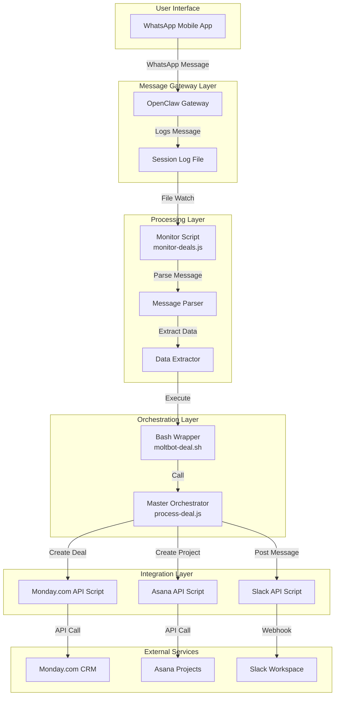
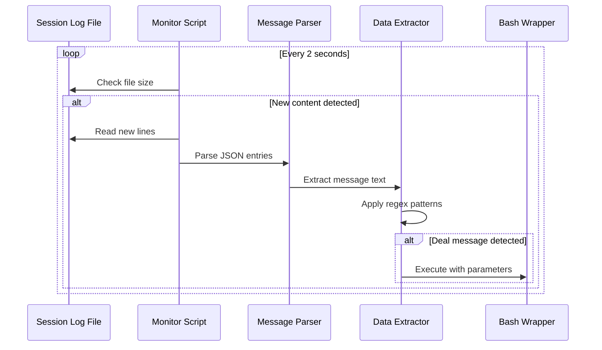
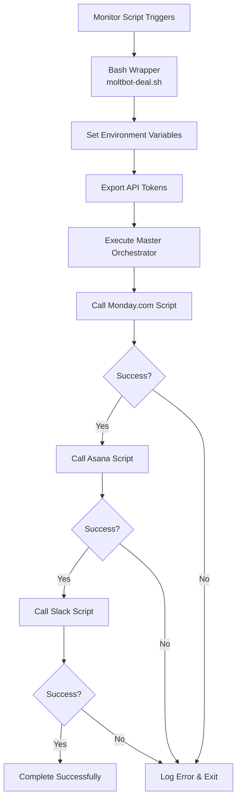
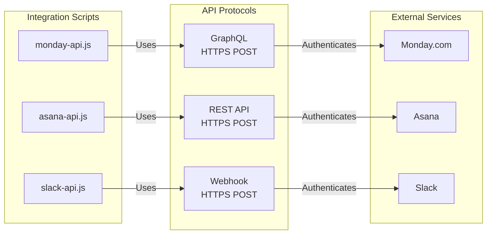
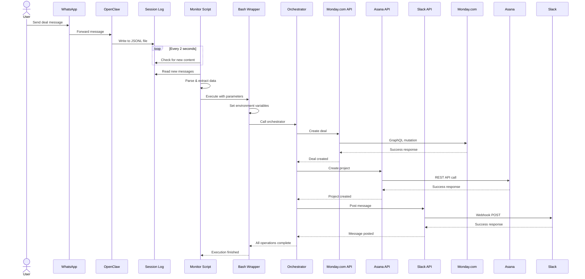
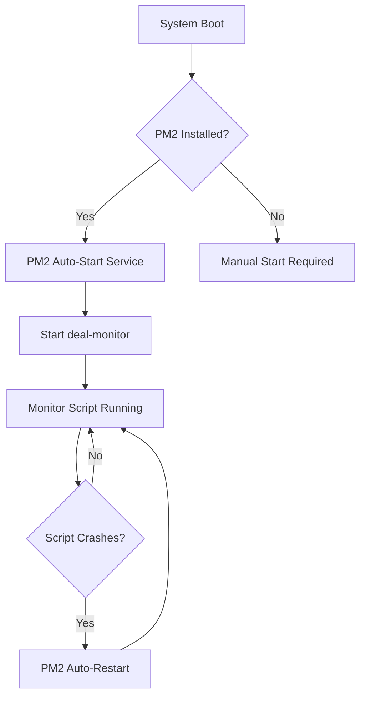

# Solution Design and Details

This document provides an in-depth technical analysis of the Executive Assistant automation system, including architecture diagrams, component interactions, and implementation details.

## System Architecture Overview

The Executive Assistant automation system is built on a microservices-inspired architecture that separates concerns into distinct, loosely-coupled components. The system operates on an event-driven model where WhatsApp messages trigger a cascade of automated actions across multiple platforms.



## Component Architecture

### 1. Message Gateway Layer

The Message Gateway Layer is responsible for receiving WhatsApp messages and persisting them to a log file for downstream processing.

#### OpenClaw Gateway

OpenClaw serves as the WhatsApp gateway, maintaining a persistent connection to WhatsApp Web and receiving incoming messages. The gateway operates in a non-conversational mode (`selfChatMode: false`) to minimize AI-driven responses and focus on message logging.

**Key Configuration:**
- **Port**: 18789 (WebSocket)
- **Bind Mode**: Loopback (localhost only)
- **Authentication**: Token-based
- **WhatsApp Policy**: Allowlist-based (specific phone numbers)

**Technical Implementation:**
```javascript
// OpenClaw configuration snippet
{
  "channels": {
    "whatsapp": {
      "dmPolicy": "allowlist",
      "selfChatMode": false,
      "allowFrom": ["+1234567890"]
    }
  }
}
```

#### Session Log File

OpenClaw writes all incoming and outgoing messages to a JSONL (JSON Lines) file located at:
```
~/.openclaw/agents/main/sessions/{session-id}.jsonl
```

Each line in this file represents a single message event with metadata including timestamp, sender, and message content.

**Example Log Entry:**
```json
{
  "type": "message",
  "id": "cac4b06e",
  "timestamp": "2026-02-21T06:39:56.084Z",
  "message": {
    "role": "user",
    "content": [{
      "type": "text",
      "text": "We just closed the Saroy Group Inc deal for $50k"
    }]
  }
}
```

### 2. Processing Layer

The Processing Layer monitors the session log file, detects deal-related messages, and extracts relevant data.



#### Monitor Script (monitor-deals.js)

The monitor script is a Node.js application managed by PM2 that continuously watches the session log file for new entries. It implements a file-tailing mechanism that tracks the last read position and only processes new content.

**Core Algorithm:**
1. Initialize with current file size (skip historical messages)
2. Every 2 seconds, check if file size has increased
3. If new content exists, read only the new bytes
4. Parse each new line as JSON
5. Filter for user messages (role: "user")
6. Apply regex patterns to detect deal announcements
7. Extract company name and deal value
8. Execute automation script with extracted parameters

**Message Detection Patterns:**
```javascript
// Pattern 1: "closed/won the [Company] deal for $[Amount]"
/(?:closed|won)\s+(?:the\s+)?([\w\s&.,'-]+?)\s+deal\s+for\s+\$?([\d,]+(?:\.\d+)?)[kKmM]?/i

// Pattern 2: "closed [Company] for $[Amount]"
/closed\s+([\w\s&.,'-]+?)\s+for\s+\$?([\d,]+(?:\.\d+)?)[kKmM]?/i
```

**Amount Parsing Logic:**
- Detects "k" or "K" suffix and multiplies by 1,000
- Detects "m" or "M" suffix and multiplies by 1,000,000
- Removes commas from numbers
- Converts to integer

**Examples:**
- `$50k` → `50000`
- `$1.5M` → `1500000`
- `$75,000` → `75000`

### 3. Orchestration Layer

The Orchestration Layer coordinates the execution of multiple API integration scripts in sequence.



#### Bash Wrapper (moltbot-deal.sh)

The bash wrapper serves as an environment configuration layer that sets up API credentials and invokes the master orchestrator.

**Responsibilities:**
- Accept company name and deal value as command-line arguments
- Change to the correct working directory
- Export API tokens as environment variables
- Execute the Node.js orchestrator

**Security Consideration:**
API tokens are stored directly in this script file with restricted permissions (chmod 700) to prevent unauthorized access.

#### Master Orchestrator (process-deal.js)

The master orchestrator is a Node.js script that executes the three API integration scripts sequentially using `execSync` from the `child_process` module.

**Execution Flow:**
1. Receive company name and deal value from command-line arguments
2. Execute Monday.com API script
3. Wait for completion (synchronous)
4. Execute Asana API script
5. Wait for completion (synchronous)
6. Execute Slack API script
7. Wait for completion (synchronous)
8. Report overall success or failure

**Error Handling:**
If any script fails, the orchestrator catches the error, logs it, and exits with a non-zero status code. This prevents partial updates where some platforms are updated but others are not.

### 4. Integration Layer

The Integration Layer contains individual API client scripts for each external service.



#### Monday.com API Script (monday-api.js)

**API Type**: GraphQL  
**Authentication**: Bearer token in Authorization header  
**Endpoint**: `https://api.monday.com/v2`

**Operation**: Creates a new item (deal) in a specified board with the following fields:
- **Item Name**: Company name
- **numbers**: Deal value (numeric column)
- **status**: Deal stage (status column, set to "Closed Win")

**GraphQL Mutation:**
```graphql
mutation {
  create_item (
    board_id: YOUR_BOARD_ID,
    item_name: "Company Name",
    column_values: "{\"numbers\":\"50000\",\"status\":\"Closed Win\"}"
  ) {
    id
  }
}
```

#### Asana API Script (asana-api.js)

**API Type**: REST API  
**Authentication**: Bearer token in Authorization header  
**Endpoint**: `https://app.asana.com/api/1.0/projects`

**Operation**: Creates a new project in a specified workspace with:
- **Name**: "[Company Name] Onboarding"
- **Workspace**: Target workspace GID
- **Notes**: Description of the onboarding project

**REST API Request:**
```json
POST /api/1.0/projects
{
  "data": {
    "name": "Company Name Onboarding",
    "workspace": "WORKSPACE_ID",
    "notes": "Onboarding project for Company Name"
  }
}
```

#### Slack API Script (slack-api.js)

**API Type**: Incoming Webhook  
**Authentication**: Webhook URL (contains authentication token)  
**Endpoint**: Custom webhook URL provided by Slack

**Operation**: Posts a formatted message to a specified Slack channel.

**Message Format:**
```
🎉 Great news! We closed the [Company Name] deal for $[Amount]!
```

**Webhook Payload:**
```json
{
  "text": "🎉 Great news! We closed the Company Name deal for $50000!"
}
```

## Data Flow Sequence

The following sequence diagram illustrates the complete end-to-end data flow from WhatsApp message to platform updates.



## Process Management

The monitor script is managed by PM2 (Process Manager 2), a production-grade process manager for Node.js applications.



**PM2 Configuration:**
- **Process Name**: deal-monitor
- **Script Path**: /home/ubuntu/monitor-deals.js
- **Auto-Restart**: Enabled
- **Startup Script**: Configured for system boot

**PM2 Commands:**
```bash
pm2 start /home/ubuntu/monitor-deals.js --name deal-monitor  # Start
pm2 status                                                    # Check status
pm2 logs deal-monitor                                         # View logs
pm2 restart deal-monitor                                      # Restart
pm2 stop deal-monitor                                         # Stop
```

## Error Handling and Resilience

The system implements multiple layers of error handling to ensure reliability and provide visibility into failures.

### Monitor Script Error Handling

- **File Not Found**: Silently continues checking (file may not exist yet)
- **Invalid JSON**: Skips malformed log entries without crashing
- **Regex No Match**: Ignores messages that don't match deal patterns
- **Execution Failure**: Logs error but continues monitoring for next message

### API Script Error Handling

Each API script implements promise-based error handling:

```javascript
// Example error handling pattern
apiCall()
  .then(result => {
    console.log('✅ Success:', result);
    process.exit(0);
  })
  .catch(error => {
    console.error('❌ Error:', error.message);
    process.exit(1);
  });
```

**HTTP Status Code Handling:**
- **200/201**: Success - log confirmation and exit with code 0
- **4xx/5xx**: Error - log error message and exit with code 1

### Orchestrator Error Handling

The orchestrator uses `try-catch` blocks around synchronous executions:

```javascript
try {
  execSync('node monday-api.js ...', { stdio: 'inherit' });
  execSync('node asana-api.js ...', { stdio: 'inherit' });
  execSync('node slack-api.js ...', { stdio: 'inherit' });
  console.log('✅ All done!');
} catch (error) {
  console.error('❌ Error:', error.message);
  process.exit(1);
}
```

If any script fails, subsequent scripts are not executed, preventing inconsistent state across platforms.

## Security Considerations

### API Token Storage

API tokens are stored in the bash wrapper script (`moltbot-deal.sh`) as environment variables. This approach has the following security implications:

**Advantages:**
- Tokens are not hardcoded in individual API scripts
- Tokens are passed via environment variables (not visible in process list)
- File permissions can be restricted (chmod 700)

**Limitations:**
- Tokens are stored in plaintext on disk
- Anyone with file read access can extract tokens

**Recommended Improvements:**
- Use a secrets management system (e.g., HashiCorp Vault, AWS Secrets Manager)
- Encrypt the bash script file
- Use environment variables set at the system level

### Network Security

All API communications use HTTPS (TLS/SSL) to encrypt data in transit. The system does not expose any listening ports to external networks (OpenClaw binds to loopback only).

### Access Control

- **OpenClaw**: Allowlist-based access (only specific WhatsApp numbers can trigger automation)
- **File Permissions**: Scripts and configuration files should be owned by the service user with restricted permissions
- **PM2**: Runs under a specific user account with limited privileges

## Performance Characteristics

### Latency

The system introduces minimal latency between message receipt and platform updates:

1. **WhatsApp → OpenClaw**: Near-instantaneous (< 1 second)
2. **OpenClaw → Log File**: Immediate (synchronous write)
3. **Log File → Monitor Detection**: Up to 2 seconds (polling interval)
4. **Execution Time**: 3-5 seconds (depends on API response times)

**Total End-to-End Latency**: 5-8 seconds

### Throughput

The system processes messages sequentially with no queuing mechanism. If multiple deal messages are sent in rapid succession, they will be processed one at a time in the order they appear in the log file.

**Maximum Throughput**: Approximately 10-15 deals per minute (limited by API rate limits and sequential processing)

### Resource Utilization

- **CPU**: Minimal (< 1% during idle, < 5% during processing)
- **Memory**: ~50 MB for monitor script, ~100 MB for OpenClaw
- **Disk I/O**: Minimal (small log file reads every 2 seconds)
- **Network**: Minimal (only during API calls)

## Scalability Considerations

### Current Limitations

- **Single Instance**: Only one monitor script can run per session file
- **Sequential Processing**: No parallel execution of deals
- **No Queue**: Messages are processed immediately without buffering

### Potential Improvements

1. **Message Queue**: Implement a queue (e.g., Redis, RabbitMQ) to buffer incoming deals
2. **Parallel Processing**: Execute API calls in parallel instead of sequentially
3. **Multiple Workers**: Run multiple monitor instances with work distribution
4. **Database**: Store deal records in a database for audit trail and retry logic

## Monitoring and Observability

### Logging

The system produces logs at multiple levels:

1. **PM2 Logs**: Process-level logs (start, stop, restart events)
2. **Monitor Script Logs**: Deal detection and execution events
3. **API Script Logs**: Success/failure of individual API calls
4. **OpenClaw Logs**: Message receipt and gateway events

**Log Locations:**
- PM2 logs: `~/.pm2/logs/deal-monitor-*.log`
- OpenClaw logs: `/tmp/openclaw/openclaw-*.log`

### Metrics

Key metrics to monitor:

- **Messages Received**: Count of WhatsApp messages processed
- **Deals Detected**: Count of messages matching deal patterns
- **Successful Executions**: Count of complete automation runs
- **Failed Executions**: Count of errors during processing
- **API Response Times**: Latency for each external service

### Alerting

Recommended alerts:

- Monitor script down (PM2 restart failures)
- High error rate (> 10% of executions failing)
- API authentication failures
- Disk space low (session log file growth)

## Future Enhancements

### Planned Features

1. **Bidirectional Communication**: Send confirmation messages back to WhatsApp
2. **Deal Validation**: Verify deal data before creating records
3. **Custom Templates**: Support for different deal types and workflows
4. **Web Dashboard**: Real-time monitoring and management interface
5. **Retry Logic**: Automatic retry for transient API failures
6. **Audit Trail**: Complete history of all processed deals in a database

### Technical Debt

1. **Hardcoded IDs**: Board IDs, workspace IDs should be configurable
2. **No Tests**: Add unit tests and integration tests
3. **Error Recovery**: Implement graceful degradation when services are unavailable
4. **Configuration Management**: Move configuration to external files
